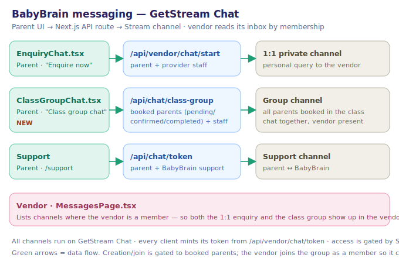

# BabyBrain

A marketplace connecting parents with children's activities and classes in Singapore. Two Vite single-page apps (a parent app and a vendor portal) share a single Next.js backend (API routes + webhooks) on top of Supabase, with GetStream for chat and Stripe for payments.

- `app/` — Next.js API routes, webhooks, and middleware
- `frontends/parent/` — parent-facing Vite SPA (served at `/app/`)
- `frontends/vendor/` — vendor portal Vite SPA (served at `/vendor/`)
- `lib/`, `supabase/` — shared server helpers and database migrations
- `docs/` — architecture notes

See [docs/backend-architecture.md](docs/backend-architecture.md) and [docs/vendor-architecture.md](docs/vendor-architecture.md) for detail.

## Messaging architecture

Chat runs on [GetStream](https://getstream.io/). There are three flows, all gated by Supabase auth, with every client minting its token from `/api/vendor/chat/token`:



| Flow | Parent UI | API route | Who's in the channel |
| --- | --- | --- | --- |
| 1:1 enquiry (personal query) | `EnquiryChat.tsx` | [`/api/vendor/chat/start`](app/api/vendor/chat/start/route.ts) | parent + provider staff |
| **Class group chat** | `ClassGroupChat.tsx` | [`/api/chat/class-group`](app/api/chat/class-group/route.ts) | every parent booked in the class + provider staff |
| Support | `/support` | [`/api/chat/token`](app/api/chat/token/route.ts) | parent + BabyBrain support |

The vendor never needs to open a channel explicitly — [`MessagesPage.tsx`](frontends/vendor/src/pages/MessagesPage.tsx) lists every channel the vendor is a member of, so both the 1:1 enquiry and the class group appear in its inbox automatically. Creating or joining the class group is gated to parents with a live booking (`pending` / `confirmed` / `completed`); the provider's active staff are added as members so the vendor is present to answer.

## Codebase map (Graphify)

The repo is indexed into a queryable knowledge graph with [Graphify](https://github.com/Graphify-Labs/graphify) — **1174 nodes · 2056 edges · 83 communities**, built entirely from local AST parsing (no API calls). Outputs live in [`graphify-out/`](graphify-out/):

- [`graphify-out/graph.html`](graphify-out/graph.html) — interactive, clickable graph (open in a browser)
- [`graphify-out/GRAPH_REPORT.md`](graphify-out/GRAPH_REPORT.md) — key concepts, community hubs, and suggested queries
- [`graphify-out/graph.json`](graphify-out/graph.json) — full graph data for programmatic access

Rebuild and query it (offline, zero API cost):

```bash
export PATH="$HOME/.graphify-venv/bin:$PATH"
graphify update .                        # rebuild after code changes
graphify query "how does booking work"   # navigate the repo by question
graphify explain "getStreamServerClient" # explain a symbol and its neighbours
```

## Development

```bash
npm run dev                              # Next.js backend
npm --prefix frontends/parent run dev    # parent SPA
npm --prefix frontends/vendor run dev    # vendor SPA
```
