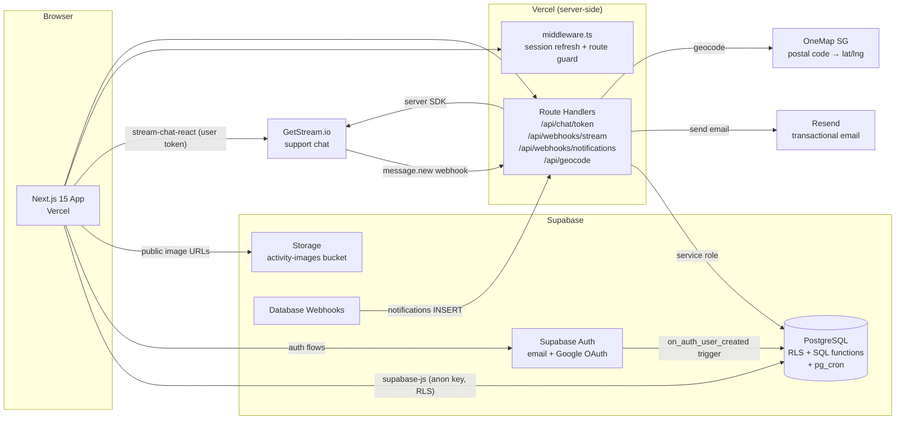
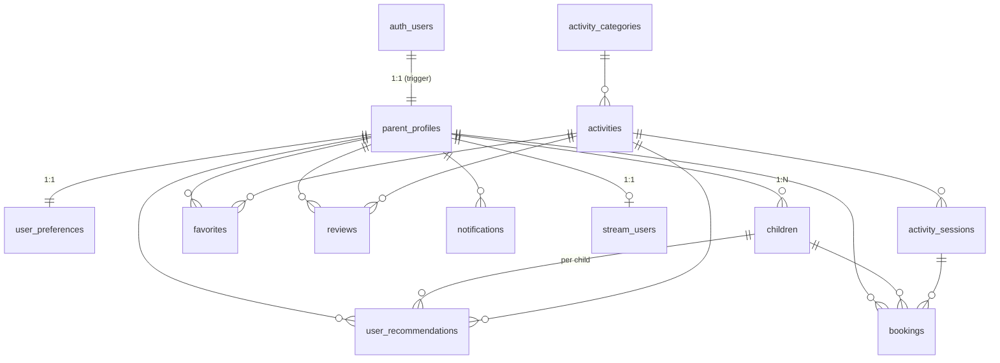
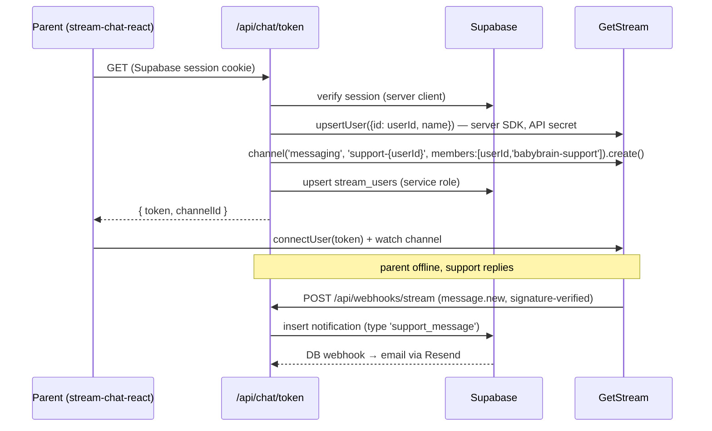

# BabyBrain Phase 1 — Backend Architecture

Backend design for the existing parent-side frontend (`index.html`, `explore.html`, `matches.html`, `onboarding.html`, `profile.html`, `contact.html`), to be implemented as a Next.js 15 + Supabase application.

**Design philosophy:** Supabase *is* the backend. Next.js talks to Postgres directly through `supabase-js` with RLS enforcing data isolation. There is no separate API server. Custom server code exists only where a secret key is required (GetStream tokens, Resend emails, webhooks, geocoding). Everything else — CRUD, search, recommendations — lives in Postgres as tables, RLS policies, and SQL functions.

---

## 1. System Architecture Diagram



**Data flow rules**

| Concern | Path |
|---|---|
| Reads/writes of user data, catalog, favorites, reviews | Browser → `supabase-js` → Postgres (RLS) |
| Search, recommendations, journey stats | Browser → Postgres RPC (SQL functions) |
| Anything needing a secret (Stream API secret, Resend key, service role) | Browser → Next.js Route Handler |
| Async events (emails, chat notifications) | Postgres/Stream webhooks → Route Handlers |

---

## 2. Database ERD



12 tables total. `users` is Supabase's managed `auth.users` — we never create our own users table; `parent_profiles` extends it 1:1 via a signup trigger. `bookings` and `activity_sessions` are included now (schema only) because the dashboard's Upcoming Classes, Activity History, and Journey stats all read from them, and the explore page's Date filter needs concrete session dates — but the booking *flow* ships in a later phase.

---

## 3–4. Database Schema & Migrations

Full SQL in [supabase/migrations](../supabase/migrations):

| File | Contents |
|---|---|
| [00001_schema.sql](../supabase/migrations/00001_schema.sql) | All 12 tables, FKs, check constraints, indexes (incl. FTS `tsvector` + GIN for search) |
| [00002_rls.sql](../supabase/migrations/00002_rls.sql) | RLS policies + storage policy + column-level grant |
| [00003_functions_triggers_seed.sql](../supabase/migrations/00003_functions_triggers_seed.sql) | Helpers, signup trigger, rating trigger, recommendation engine, search RPC, journey-stats RPC, pg_cron jobs, category seed |

Schema decisions worth calling out:

- **Arrays over join tables** for interests, preferred days/times, tags, and image URLs. At MVP scale a `text[]` with a `<@` check constraint is simpler than 4 extra junction tables, and Postgres `&&` overlap operators make matching trivial.
- **Child age is computed, never stored** — `child_age_months(date_of_birth)` SQL helper (and the same trivially in TS). Stored ages go stale.
- **Denormalized `rating_avg` / `rating_count` / `popularity`** on `activities` so the explore list never aggregates per request. Rating is trigger-maintained on review writes; popularity (favorites + 2×reviews) refreshes nightly via pg_cron.
- **No PostGIS.** A haversine `distance_km()` SQL function is plenty for "within 10 km" in Singapore at 10k users.
- **Provider is a text field** on `activities`. Provider accounts are a future phase; don't model them yet.

Apply with `npx supabase db push` (or paste into the SQL editor in order).

---

## 5. RLS Policies

See [00002_rls.sql](../supabase/migrations/00002_rls.sql). The model:

| Table | anon | authenticated | writes |
|---|---|---|---|
| `parent_profiles`, `user_preferences` | — | own row | update own (insert via trigger) |
| `children` | — | own children | full CRUD own |
| `activity_categories`, `activities` (published), `activity_sessions`, `reviews` | read | read | reviews: write own; catalog: service role only |
| `favorites` | — | own | insert/delete own |
| `user_recommendations` | — | read own | engine function only (`security definer`) |
| `notifications` | — | read own | clients may update **only `read_at`** (column-level grant) |
| `stream_users`, `bookings` | — | read own | server-side only |

Key points:

- **Child data isolation**: `children` rows are only visible where `parent_id = auth.uid()` — no public path to any child data, and recommendations (which embed child context) are equally locked down.
- **Admin writes need zero policies**: activities/sessions/categories are managed via Supabase Studio or service-role scripts, which bypass RLS. No admin portal in Phase 1.
- **Notifications hardening**: `REVOKE UPDATE` + `GRANT UPDATE (read_at)` means even an authenticated user crafting raw PostgREST calls can only mark their own notifications read, not rewrite their content.
- **Storage**: `activity-images` bucket is public-read; no insert policy for `authenticated` means only the service role uploads.

---

## 6. Authentication Architecture

Supabase Auth with `@supabase/ssr` (cookie-based sessions, the standard Next.js 15 setup).

**Clients**
- `lib/supabase/client.ts` — `createBrowserClient` for client components
- `lib/supabase/server.ts` — `createServerClient` for server components / route handlers
- `middleware.ts` — refreshes the session cookie on every request and redirects unauthenticated users away from `/dashboard`, `/onboarding`

**Flows**

| Flow | Mechanism |
|---|---|
| Email signup | `auth.signUp({ email, password, options: { data: { full_name } } })` → confirmation email (via Resend SMTP) → `on_auth_user_created` trigger creates `parent_profiles` + `user_preferences` + welcome notification → redirect to `/onboarding` |
| Email login | `auth.signInWithPassword` → if `onboarding_completed_at` is null → `/onboarding`, else `/dashboard` |
| Google OAuth | `auth.signInWithOAuth({ provider: 'google' })` → Google → `/auth/callback/route.ts` (`exchangeCodeForSession`) → same trigger fires (idempotent: profile insert only happens on first signup) |
| Password reset | `auth.resetPasswordForEmail(email, { redirectTo: '/reset-password' })` → user sets new password via `auth.updateUser` |
| Session management | Handled entirely by `@supabase/ssr` cookies + middleware refresh; logout = `auth.signOut()` |

**Onboarding maps directly to the existing 3-step UI:**
1. Step 1 → `update parent_profiles` (name, phone, postal code; server geocodes postal code → lat/lng via OneMap) + `update user_preferences` (days, times, budget, interests)
2. Step 2 → `insert children` (repeatable for multiple children) — the insert trigger immediately computes that child's recommendations
3. Step 3 (preview/confirm) → set `onboarding_completed_at = now()` → redirect to `/matches` which reads `user_recommendations` (already computed)

Configure Resend as Supabase's custom SMTP so confirmation/reset emails come from `@babybrain.sg`.

---

## 7. Recommendation Engine Architecture

Deterministic scoring, implemented entirely as a Postgres function — no AI, no embeddings, no external service, nothing to deploy or monitor.

**Scoring (0–100), per child × published activity:**

| Factor | Points | Rule |
|---|---|---|
| Age match | 30 | child age within `[age_min, age_max]` (prefilter excludes anything beyond ±3 months; near-misses score 15) |
| Interest match | 30 | category slug or activity tags overlap (child interests ∪ parent interests) |
| Location match | 20 | haversine from parent's geocoded postal code: ≤3 km → 20, ≤7 km → 12, ≤15 km → 5; unknown → 5 |
| Budget match | 10 | `price ≤ budget_max` → 10; either unknown → 5 |
| Schedule match | 10 | an upcoming session exists on a preferred day **and** time of day (SGT) |

Top 20 activities scoring ≥30 are written to `user_recommendations` with a `reasons text[]` built from whichever factors scored — this directly renders the "Why these activities?" panel on `matches.html` ("Matches Emma's age", "Near your location", …).

**When it runs (all in-database, no queue):**
- Trigger on `children` insert/update (dob or interests) → recompute that child
- Trigger on `user_preferences` update or `parent_profiles` location change → recompute all of that parent's children
- Nightly pg_cron job → recompute everyone (picks up newly published activities/sessions)

At 10k users × ~500 activities this is a few milliseconds per child; precomputing into a table keeps dashboard reads to a trivial indexed `select … order by score desc`.

---

## 8. GetStream Integration Architecture

Phase 1 scope: one `messaging` channel per parent with BabyBrain support. The browser uses Stream's React SDK directly (message history, read state, typing — all Stream-native); our backend only mints tokens and bridges notifications.



**Decisions**
- **User mapping**: Stream user id = Supabase `user_id` (UUID string). `stream_users` records the mapping + channel id for auditing and future phases.
- **Channel id**: deterministic `support-{userId}` — token route is idempotent, no duplicate channels.
- **Support side**: founders answer from the Stream Dashboard (free, zero build) as the `babybrain-support` user. An in-app support inbox is a future phase.
- **Security**: API secret only in route handlers; client gets a short-lived user token scoped to their own user. Webhook verified with Stream's HMAC signature.
- **Notifications**: Stream `message.new` webhook → insert into `notifications` only when the recipient is the parent and they're offline → the standard notification pipeline (below) handles email.

---

## 9. API Architecture

Three tiers, thinnest possible:

**Tier 1 — Direct `supabase-js` (no API code at all).** Profiles, preferences, children CRUD, categories, activity detail (`activities` + `activity_sessions` + `reviews` joins), favorites toggle, review create/edit, recommendations read, notifications read/mark-read, bookings read.

**Tier 2 — Postgres RPCs** (logic that belongs near the data):

| RPC | Used by |
|---|---|
| `search_activities(query, category, age, date, lat, lng, radius, sort, limit, offset)` | Explore page — one call covers all five filter pills + map pins |
| `child_journey_stats(child_id)` | Dashboard journey card |
| `child_age_months(dob)` | Age display/matching |

**Tier 3 — Next.js Route Handlers** (secrets only):

| Route | Purpose |
|---|---|
| `GET /api/chat/token` | Verify session → Stream upsert user + ensure support channel → return user token |
| `POST /api/webhooks/stream` | Stream `message.new` → insert `support_message` notification (HMAC-verified) |
| `POST /api/webhooks/notifications` | Supabase DB webhook on `notifications` INSERT → send email via Resend → update `email_status` (shared-secret header) |
| `POST /api/geocode` | Onboarding step 1: postal code → lat/lng via OneMap SG (keeps any key server-side, normalizes errors) |
| `GET /auth/callback` | OAuth code exchange |

**Notification pipeline (the "event-driven" requirement, MVP-sized):** any event = one `INSERT INTO notifications` (from triggers, route handlers, or cron). In-app feed reads the table (optional Supabase Realtime subscription for live badges). Email fan-out is the DB webhook → Resend route. Adding Klaviyo later = one more consumer in that same route; no schema change, no queue infrastructure.

---

## 10. TypeScript Types

[types/database.ts](../types/database.ts) — full `Database` interface (tables with Row/Insert/Update shapes that mirror what RLS actually allows, e.g. `notifications.Update = { read_at }`), RPC signatures, and domain aliases (`Child`, `Activity`, `ActivitySearchResult`, `RecommendationWithActivity`, …). Regenerate from the live schema with `supabase gen types typescript` once the project exists.

---

## 11. Folder Structure (Next.js 15 app)

The existing HTML pages map 1:1 onto routes:

```
babybrain/
├── middleware.ts                     # session refresh + auth guard
├── app/
│   ├── (public)/
│   │   ├── page.tsx                  # index.html
│   │   ├── explore/page.tsx          # explore.html (search_activities RPC + map)
│   │   ├── activities/[slug]/page.tsx# detail: info, images, schedule, reviews
│   │   └── contact/page.tsx          # contact.html + support chat entry
│   ├── (auth)/
│   │   ├── login/page.tsx
│   │   ├── signup/page.tsx
│   │   ├── reset-password/page.tsx
│   │   └── auth/callback/route.ts    # OAuth code exchange
│   ├── (parent)/                     # guarded by middleware
│   │   ├── onboarding/page.tsx       # 3-step wizard (onboarding.html)
│   │   ├── matches/page.tsx          # matches.html (user_recommendations)
│   │   └── dashboard/
│   │       ├── page.tsx              # profile.html: child overview + journey
│   │       ├── favorites/page.tsx
│   │       ├── reviews/page.tsx
│   │       ├── bookings/page.tsx     # upcoming + history (reads only, Phase 1)
│   │       └── notifications/page.tsx
│   └── api/
│       ├── chat/token/route.ts
│       ├── geocode/route.ts
│       └── webhooks/
│           ├── stream/route.ts
│           └── notifications/route.ts
├── components/                       # ported from existing HTML/CSS
├── lib/
│   ├── supabase/{client,server,middleware}.ts
│   ├── stream.ts                     # server-side StreamChat singleton
│   ├── resend.ts
│   └── geocode.ts                    # OneMap SG wrapper
├── types/database.ts
└── supabase/migrations/*.sql
```

**Environment variables:** `NEXT_PUBLIC_SUPABASE_URL`, `NEXT_PUBLIC_SUPABASE_ANON_KEY`, `SUPABASE_SERVICE_ROLE_KEY`, `NEXT_PUBLIC_STREAM_KEY`, `STREAM_SECRET`, `RESEND_API_KEY`, `WEBHOOK_SHARED_SECRET`.

---

## 12. Implementation Roadmap (~4 weeks, one founder-engineer)

**Week 1 — Foundation**
Supabase project; run the 3 migrations; configure Google OAuth + Resend SMTP; Next.js scaffold with `@supabase/ssr`, middleware, generated types; port homepage/explore markup into components; signup/login/reset flows end-to-end (trigger creates profile rows).

**Week 2 — Onboarding + Catalog**
3-step onboarding wizard writing to `parent_profiles`/`user_preferences`/`children` (+ geocode route); seed ~30 real activities + sessions via Studio/CSV; activity detail page; explore page wired to `search_activities` with all filter pills + map pins.

**Week 3 — Personalization**
Matches page from `user_recommendations` with reasons panel; dashboard (child overview, journey stats RPC, upcoming/history reads); favorites toggle everywhere; reviews submit/edit with live rating rollup; verify recommendation triggers + enable pg_cron jobs.

**Week 4 — Chat, Notifications, Launch**
GetStream token route + support chat UI + Stream webhook; notifications DB webhook → Resend emails + in-app feed; RLS audit (attempt cross-user access for every table); Vercel production deploy, custom domain, OAuth redirect URLs; smoke-test full journey: signup → onboard → matches → favorite → review → support chat.

**Explicitly deferred:** booking flow (schema ready), provider/vendor/admin portals, parent↔parent and parent↔provider messaging, Klaviyo (slots into the notification webhook), payments.
