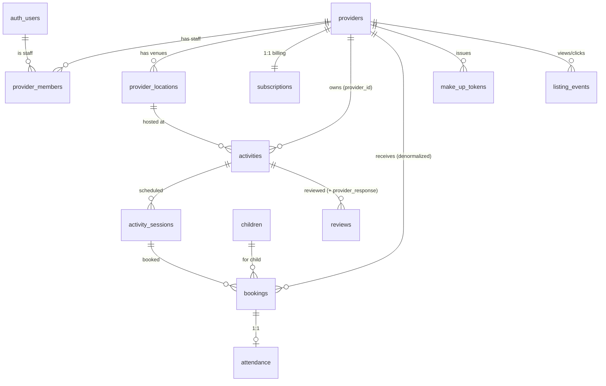

# BabyBrain Phase 2 — Vendor/Provider Backend Architecture

Extends the live Phase 1 parent platform. **Reuses** Supabase Auth, the existing `activities` / `activity_sessions` / `bookings` / `reviews` / `notifications` / `stream_users` tables, the Resend notification pipeline, and GetStream. **No parallel systems, no duplicate activity tables.**

Source of truth: the vendor PPT screen spec + the live Phase 1 database.

---

## 1. Screen → backend objects (analysis)

| PPT screen | Action(s) | Backend object(s) |
|---|---|---|
| 1 Home · 2 Plans · 3 Contact | browse, compare, enquire | none (static) + `subscriptions` plan copy |
| 4 Sign Up | create vendor account | Supabase Auth (reused) |
| 5 Claim & Verify | find listing, verify ownership | `providers` (is_claimed, verification_status, uen) |
| 6 Compliance & Consents | accept gated consents | `providers` (status gate) — consents stored in `providers.social`/jsonb or a lightweight flag; no new system |
| 7 Plan Selection + Stripe | pick plan, connect payouts | `subscriptions` + Stripe (Checkout/Connect) |
| 8 Listing Setup (Save) | edit & publish listing | `activities` (provider_id, vendor_category, requires_medical_disclosure), `provider_locations` |
| 9 Account Status | see live/pending state | `providers.status`, `provider_members` |
| 10 Dashboard/Overview | KPIs | `provider_overview()` RPC |
| 11 Business Profile | edit info/images/contact | `providers` |
| 12 Manage Locations | add/edit venues | `provider_locations` |
| 13–14 Activities list/editor | CRUD activities | `activities` (extended) |
| 15 Sessions & Schedule | capacity, availability, recurring | `activity_sessions` (extended: location_id, status) |
| 16 Booking Management | view/manage bookings, medical disclosure | `bookings` (extended) |
| 17 Waitlist | promote when space opens | `bookings` status `waitlisted` + `promote_waitlist_entry()` |
| 18 Attendance | present/absent/late, make-up tokens | `attendance`, `make_up_tokens` |
| 19 Messages | parent ↔ provider | GetStream (expanded) + `stream_users` |
| 20 Reviews | view & respond | `reviews` (extended) + `respond_to_review()` |
| 21 Analytics | bookings, attendance, age group, day/time, location | `provider_analytics()` RPC + `listing_events` |
| 22 Boost Visibility | buy featured placement | `activities.boosted_until` + Stripe one-off |
| 23 Staff Access | invite, roles | `provider_members` |
| 24 Plan & Billing | upgrade, invoices, gating | `subscriptions` + Stripe |

---

## 2. Architecture diagram

```mermaid
flowchart LR
    subgraph Browser
        VP[Vendor portal — Next.js<br/>left-rail screens 10–24]
        PUB[Public acquisition 1–3]
    end
    subgraph Vercel["Route handlers (secrets only)"]
        STK[/api/vendor/stripe/checkout<br/>/api/vendor/stripe/portal/]
        WH[/api/webhooks/stripe/]
        STAFF[/api/vendor/staff/invite/]
        CHAT[/api/chat/token (reused, extended)/]
    end
    subgraph Supabase
        PG[(PostgreSQL<br/>providers · provider_members · provider_locations<br/>+ extended activities/sessions/bookings/reviews<br/>attendance · make_up_tokens · subscriptions · listing_events<br/>RLS + role helpers + RPCs)]
        AUTH[Supabase Auth — reused]
    end
    GS[GetStream — parent↔provider channels]
    STRIPE[Stripe — subscriptions + Connect payouts]
    RS[Resend — reused notification pipeline]

    VP -- supabase-js (RLS, role-scoped) --> PG
    VP --> STK & STAFF
    VP -- stream-chat-react --> GS
    STK --> STRIPE
    STRIPE -- subscription events --> WH --> PG
    PG -- notifications INSERT --> RS
    CHAT --> GS
```

**Tiers (same philosophy as Phase 1):** vendor CRUD/reads go directly through `supabase-js` under role-scoped RLS; only secret-bearing work (Stripe, staff invite, Stream token) lives in route handlers; analytics are Postgres RPCs.

---

## 3. ERD (new + extended)



New tables: `providers`, `provider_members`, `provider_locations`, `attendance`, `make_up_tokens`, `subscriptions`, `listing_events`. Extended in place: `activities` (+provider_id, location_id, vendor_category, requires_medical_disclosure, archived_at, boosted_until), `activity_sessions` (+location_id, status), `bookings` (+provider_id, full state machine, payment, medical_disclosure, waitlist_position), `reviews` (+provider_response).

---

## 4. SQL migrations

| File | Contents |
|---|---|
| [00006_vendor_schema.sql](../supabase/migrations/00006_vendor_schema.sql) | 7 new tables + in-place ALTERs to activities/sessions/bookings/reviews; indexes |
| [00007_vendor_rls.sql](../supabase/migrations/00007_vendor_rls.sql) | role helper functions + RLS on all vendor surfaces |
| [00008_vendor_functions.sql](../supabase/migrations/00008_vendor_functions.sql) | provider/booking triggers, waitlist promotion, review RPC, analytics RPCs |

Applied to the hosted DB; **[scripts/validate-vendor.mjs](../scripts/validate-vendor.mjs) → 22/22 pass** (staff-role RLS, capacity→waitlist, auto-promote, attendance, review RPC, analytics, cross-vendor isolation).

---

## 5. RLS model (staff roles)

Three security-definer helpers read `provider_members` for `auth.uid()` (they bypass RLS, so no recursion):

| Helper | Returns provider_ids where the user is… |
|---|---|
| `user_provider_ids()` | any active member (owner/manager/staff) |
| `user_manage_provider_ids()` | owner **or** manager |
| `user_owner_provider_ids()` | owner only |

| Surface | Read | Write |
|---|---|---|
| `providers` | public if `status='active'`, else members | insert = self as owner; update = manager+ |
| `provider_members` | the team | **owner only** (staff management) |
| `activities` / `activity_sessions` | public (published) + members (incl. drafts) | **manager+** |
| `bookings` | parent (own) + provider members | parent insert (own); status updates = **manager+** |
| `attendance` | members | **any member incl. staff** (staff = attendance-only) |
| `make_up_tokens` | provider members + parent (own) | members |
| `subscriptions` | members | **service role only** (Stripe webhook) |
| `listing_events` | members | anyone may log a view |

Role enforcement is in the policies themselves: staff get `attendance` write but are **excluded** from `activities`/`bookings`/`provider_members` writes (validated). Parents never match any provider policy → no access to vendor data.

---

## 6. Vendor API design

**Direct supabase-js (no route code):** provider profile, locations, activities/sessions CRUD, bookings list & status, attendance marking, make-up tokens, reviews list, listing-event logging — all under role RLS.

**Postgres RPCs:** `provider_overview(provider)` (dashboard KPIs), `provider_analytics(provider, from, to)` → jsonb (age group, popular slots, location ranking, popular activities), `promote_waitlist_entry(booking)`, `respond_to_review(review, text)`.

**Route handlers (secrets only) — to build in Week 2:**

| Route | Purpose |
|---|---|
| `POST /api/vendor/stripe/checkout` | Growth subscription Checkout session (+ free-trial) |
| `POST /api/vendor/stripe/boost` | one-off Checkout for featured placement |
| `GET  /api/vendor/stripe/portal` | Stripe Billing Portal link |
| `POST /api/webhooks/stripe` | sub created/updated/deleted → write `subscriptions`; payment → `bookings.payment_status` |
| `POST /api/vendor/staff/invite` | create `provider_members` (invited) + email via Resend (owner only) |
| `GET  /api/chat/token` | **reused** — extended to also return provider channels |

---

## 7. GetStream expansion (parent ↔ provider)

Reuses the existing Stream app and `stream_users` mapping — **no new chat system.**

- **Channel id:** `pp-{providerId}-{parentId}` (type `messaging`), members = parent + each provider member who should see vendor chat. Distinct from Phase 1 `support-{userId}`.
- **Token route:** the existing `/api/chat/token` is extended — after verifying the Supabase session it upserts the Stream user and returns the parent's support channel **plus** any `pp-*` channels they're a member of. A provider member calling it gets their provider's `pp-*` channels (resolved via `user_provider_ids()`).
- **Creation:** a `pp-*` channel is created lazily the first time a parent messages a provider from an activity page (server-side, service role upserts both users as members).
- **Notifications:** the Stream `message.new` webhook (already deployed) is extended — when the recipient is offline, insert a `notifications` row (`type='provider_message'`) → existing Resend pipeline emails them. No new infra.

---

## 8. Stripe integration design

- **One Customer + one Subscription per provider**, stored in `subscriptions` (`stripe_customer_id`, `stripe_subscription_id`, `status`, `current_period_end`, `plan`). Created `free` by trigger on provider insert.
- **Upgrade to Growth:** `/api/vendor/stripe/checkout` → Checkout Session (mode `subscription`, 1-month-free trial) → on success the webhook flips `plan='growth'`, `status`, `current_period_end`.
- **Payouts (booking payments):** Stripe **Connect** (Express) onboarding during plan selection; the provider's connected account receives booking payments minus the `commission_rate` (default 15%) application fee.
- **Boost:** one-off Checkout (`mode payment`) → webhook sets `activities.boosted_until`.
- **Webhook** (`/api/webhooks/stripe`, signature-verified) is the single source of truth for billing state — the client never writes `subscriptions` (RLS denies it; service role only).
- **Gating:** a Free vendor attempting a Growth-only action (take a booking, edit booking settings) is routed to Plan & Billing; enforced in the UI + a server check on `subscriptions.plan` for booking-taking endpoints.

---

## 9. Implementation roadmap (~3 weeks on top of Phase 1)

**Week 1 — Vendor core (DB done ✅).** Vendor auth screens (reuse Supabase Auth); claim/verify + provider create; Business Profile + Manage Locations; Activities + Sessions CRUD wired to the new RLS. *(Backend + RLS already live and validated.)*

**Week 2 — Money + bookings.** Stripe Checkout/Connect + webhook; Plan & Billing + gating; Booking Management + Waitlist (promote RPC) + Attendance + make-up tokens.

**Week 3 — Engagement + launch.** Vendor dashboard (`provider_overview`) + Analytics (`provider_analytics`); Reviews respond; GetStream parent↔provider + Stream webhook extension; Boost Visibility; Staff Access UI; RLS audit (cross-vendor + staff-role); deploy.

**Explicitly excluded (per the spec's own scope):** CRM, vendor marketing toolkits/campaigns, full staff-management SaaS, external "integrate with us" software integrations, affiliate booking links, enterprise BI, Success Stories. These remain backlog.
