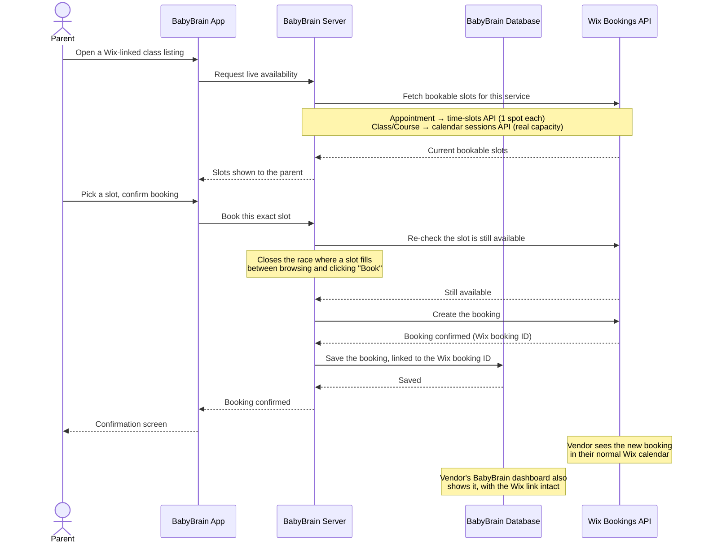

# Wix Integration Requirements & Booking Workflow

*Companion to `vendor-wix-overview.md`. This document covers exactly what a vendor needs to provide from their Wix account, how to find it, and how a booking moves through both systems end-to-end.*

## What BabyBrain needs from the vendor

Two values, both from the vendor's own Wix account:

| Value | What it's for | Sensitivity |
|---|---|---|
| **Site ID** | Identifies *which* Wix site to read/write bookings on | Not secret — safe to share over email/chat |
| **API Key** (bearer token) | Authenticates BabyBrain's server to act on that site's Bookings data | **Secret — treat like a password** |

Both get handed to BabyBrain's team, who configure them server-side. The vendor never needs to share their actual Wix login.

> Wix's dashboard menu names shift occasionally as they update their UI — the steps below reflect the current layout. If a label doesn't match exactly, search the dashboard for the bolded term.

## How to find the Wix Site ID

The most reliable way — works regardless of dashboard redesigns:

1. Log in to the Wix dashboard for the site: **manage.wix.com**
2. Look at the browser's address bar once inside the site's dashboard. It looks like:
   `https://manage.wix.com/dashboard/`**`a240b75d-88bb-414a-bf15-01f112022e66`**`/home`
3. The UUID right after `/dashboard/` **is the Site ID**.

Alternatively: **Settings → General Info**, where Wix also lists the Site ID directly.

## How to generate a Wix API Key

1. In the Wix dashboard for the site, go to **Settings**.
2. Find **API Keys** (usually under an "Advanced"/"Developer tools" section of Settings).
3. Click **Generate API Key** (or **+ New Key**).
4. Give it a clear name, e.g. `BabyBrain Integration`.
5. **Select permissions** — this step matters. Grant Bookings-related scopes only:
   - **Bookings – Read Bookings** (and Services / Availability read access)
   - **Bookings – Manage Bookings** (write access — required to actually create a booking)

   Avoid granting broader store-wide/admin permissions the integration doesn't need.
6. Confirm. **Wix shows the key exactly once** — copy it immediately into a password manager or send it securely to BabyBrain's team. If it's lost, generate a new one (the old one can be revoked from the same screen).

## Security notes

- The API key is a **secret**. Don't paste it into email, Slack, or any place outside a secure/password-protected channel.
- BabyBrain stores it **server-side only** — it's never sent to a browser or exposed to parents.
- If the key is ever suspected compromised, revoke it from the same Wix Settings → API Keys screen and generate a new one; BabyBrain's team just needs the replacement value.

## What happens after the vendor provides these

Since there's no self-service "Connect Wix" flow yet (see the overview doc's limitations section), BabyBrain's team:
1. Stores the API Key + Site ID securely on the server.
2. Looks up the vendor's actual Wix services (e.g. "Hatha Yoga", "Vinyasa Flow") and resources/staff via the Wix API.
3. Links the vendor's BabyBrain listing to the matching Wix service — including recording whether it's an **appointment** (1:1) or **class/course** (group) service, since Wix handles those two differently under the hood.

From that point on, the listing's availability is live from Wix automatically — no further setup needed.

---

## Booking workflow — how every booking is processed

### In plain terms

1. **Browsing** — a parent viewing a Wix-linked listing sees slots pulled live from Wix at that exact moment. Nothing about availability is cached or pre-stored in BabyBrain.
2. **Booking** — when the parent confirms, BabyBrain double-checks with Wix that the slot is *still* free (protects against two parents racing for the last spot), then asks Wix to create the actual booking.
3. **Two-way record** — once Wix confirms, BabyBrain saves its own copy of the booking, tagged with Wix's booking ID so the two records stay linked. From this point the booking genuinely exists in **both** systems.
4. **Vendor visibility** — the vendor sees the booking in their Wix calendar exactly as if it came from their own site, *and* in their BabyBrain vendor dashboard (roster, bookings list).
5. **Appointments vs. classes** — a 1:1 appointment always books one spot against one specific slot/resource. A group class checks and books against the class's real remaining capacity, so multiple parents can book the same class occurrence until it's full.

### One gap to know about

Cancelling or rescheduling a Wix-linked booking **from the BabyBrain side** currently only updates BabyBrain's own record — it does not yet call Wix to cancel/move the booking there too. Until that's built, cancellations made through BabyBrain need a manual double-check on the Wix side by the vendor's team.
